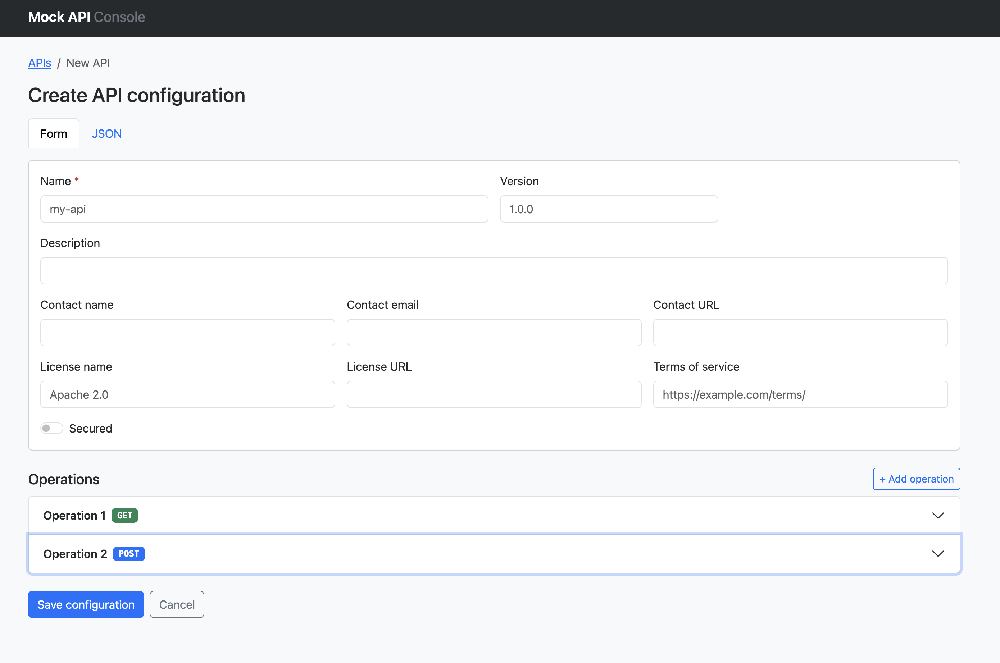
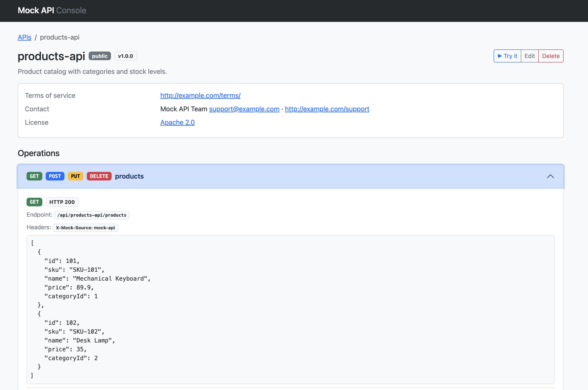
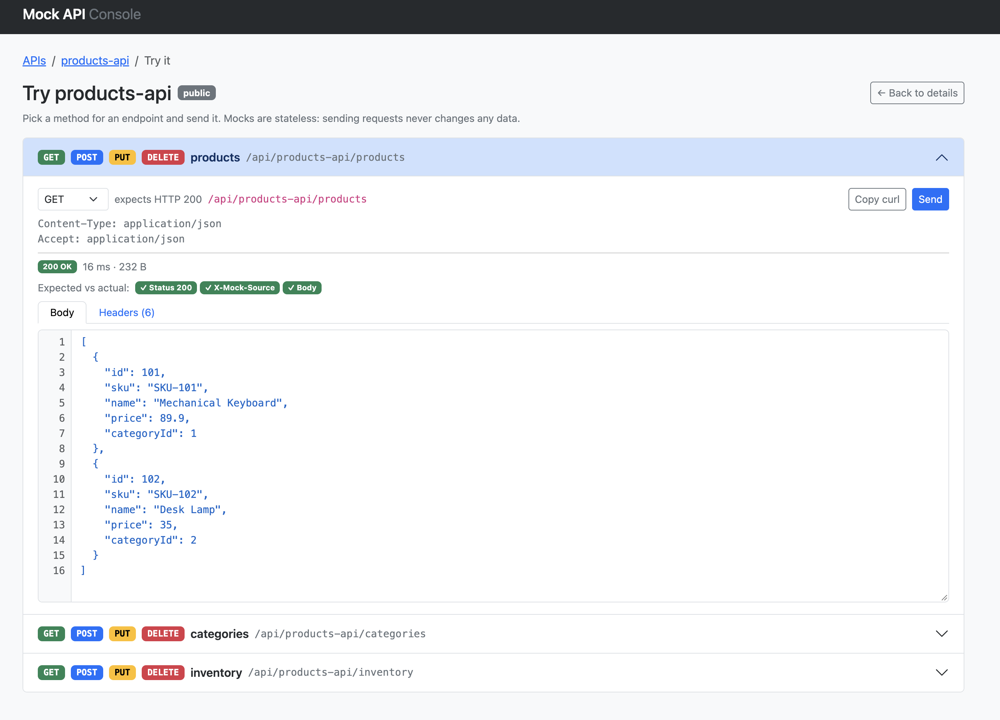

# Mock API Console (UI)

A web console for the [mock-api](https://github.com/Joxebus/mock-api) Spring Boot service.

"UI for Configuration Endpoints" plan: it lists the configured
APIs and shows the details of each one. It does **not** create, edit, or delete
configurations (that is Phase 2/3).

Built with **React + TypeScript + Vite + Bootstrap 5**.

## Screens

- **Dashboard** (`/`) — table of every configured API (from `GET /endpoint`),
  with operation and method counts. Click through to a detail view.
- **API detail** (`/apis/:apiName`) — metadata, auth, and every operation with
  its method, status code, headers, and response body. Combines
  `GET /config/{apiName}` (full config) and `GET /endpoint/{apiName}` (mock URLs).

## Prerequisites

- Node 24 (an `.nvmrc` is provided — run `nvm use`).
- The mock-api backend running on `:8080`.

## Getting started

```bash
nvm use          # selects Node 24 from .nvmrc
npm install
npm run dev      # http://localhost:5173
```

Then start the backend from the `mock-api` project:

```bash
cd ../mock-api
./gradlew bootRun
```

Create at least one configuration so the dashboard has something to show, e.g.:

```bash
curl -X POST http://localhost:8080/config \
  -H "Content-Type: application/json" \
  --data-binary @../mock-api/src/test/resources/configuration_secured.json
```

## Backend connectivity

By default the Vite dev server **proxies** `/config` and `/endpoint` to
`http://localhost:8080` (see `vite.config.ts`), so requests are same-origin and
no CORS is involved during development.

To hit the backend directly instead of via the proxy, set the base URL:

```bash
# .env.development (or .env.local)
VITE_API_BASE_URL=http://localhost:8080
```

The backend already allows the `http://localhost:5173` origin via CORS for the
`/config/**` and `/endpoint/**` routes.

## Scripts

- `npm run dev` — start the dev server.
- `npm run build` — type-check (`tsc -b`) and produce a production build in `dist/`.
- `npm run preview` — serve the production build locally.

## Project layout

Feature-based structure (see `CLAUDE.md` for the full rules):

```
src/
  app.tsx        root component: router + app-wide providers
  main.tsx       entry (Bootstrap CSS + global styles + <App/>)
  components/    generic UI with no domain knowledge (confirm-modal, loading/error/empty views)
  config/        env.ts (typed env vars), routes.ts (route patterns + path builders)
  features/
    api-configs/ everything about API configurations: api/, components/, hooks/, types/, utils/
                 import it only through features/api-configs/index.ts
  hooks/         generic hooks (useAsync)
  layouts/       MainLayout (navbar + <Outlet/>)
  pages/         thin route components (dashboard, api-detail, config-editor)
  services/      HTTP client (request, ApiError, errorMessage)
  styles/        global CSS
  types/         app-wide types (ResponseError, ImportMetaEnv)
```

Conventions: kebab-case file names, named exports only, types co-located with
the code that uses them (promoted to `features/<name>/types/` or `src/types/`
only when shared).

## Screenshots

### 🚀 Features Preview


<details>
    <summary><b>📸 Click to view screenshot gallery</b></summary>
    <br>
    
    <hr>
    
    <hr>
    
</details>